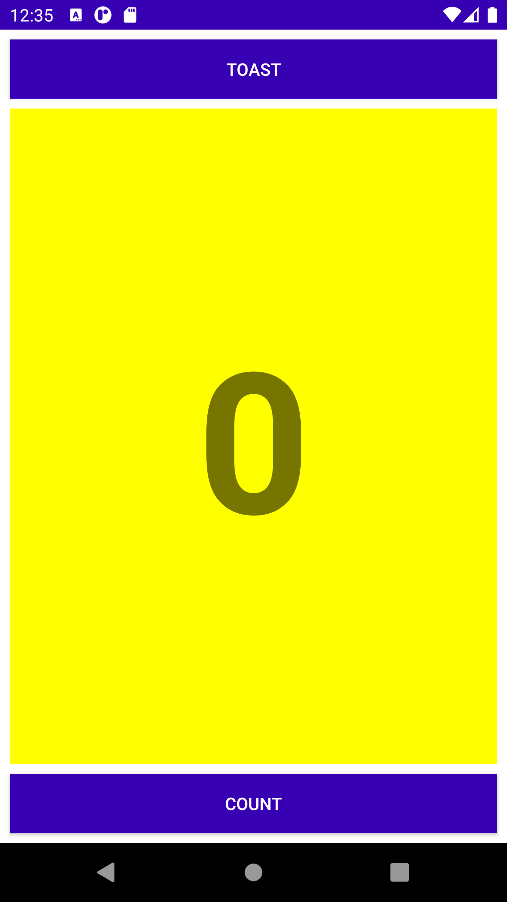
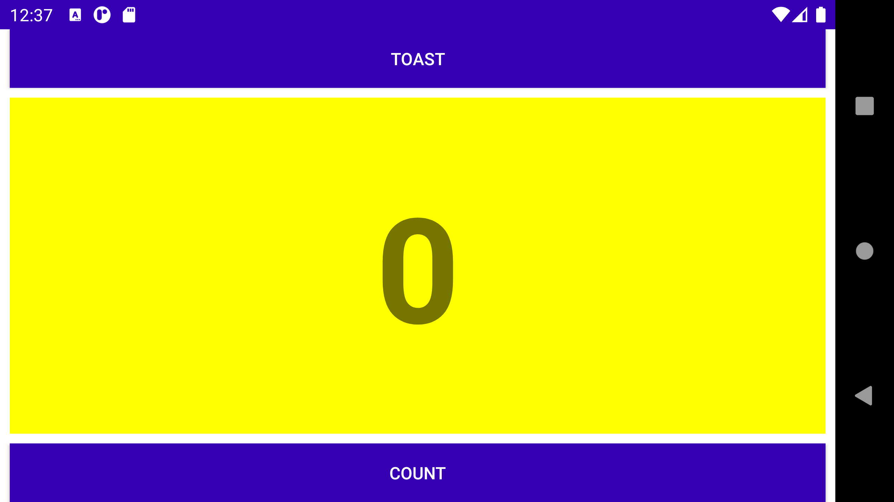
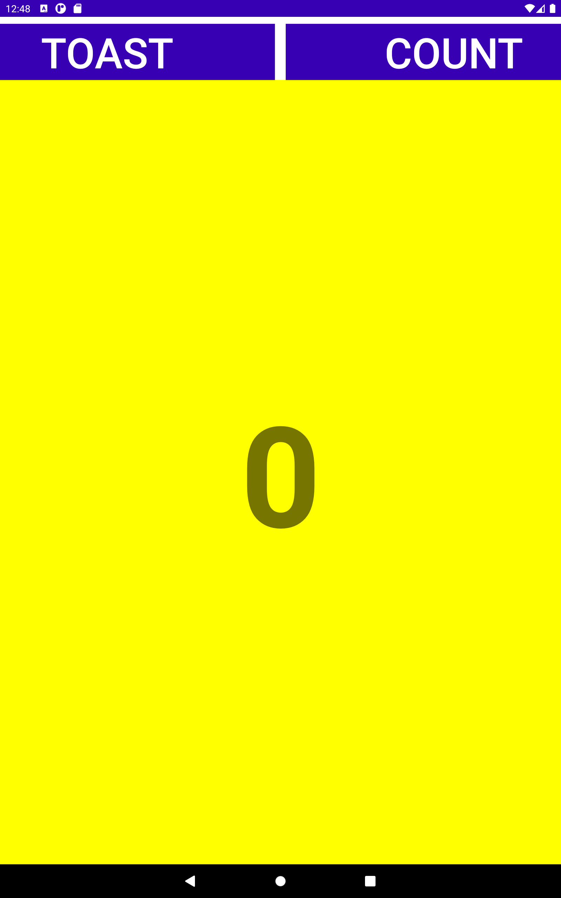
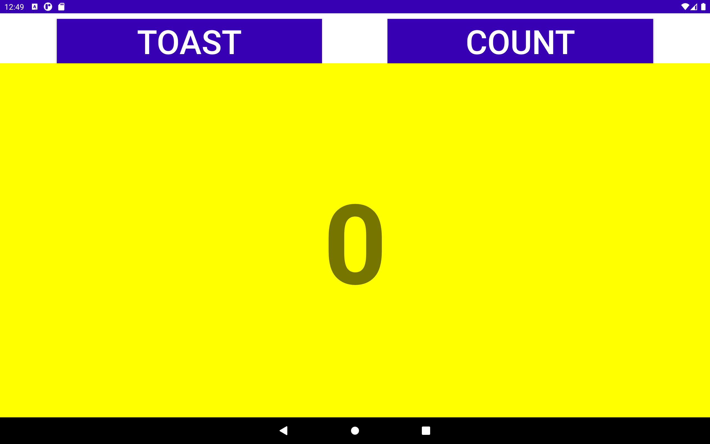

HelloToast
======================
###### Task 1
This task is all about managing layout in different screens.
###### Portrait mode in mobile screen

[]

###### Landscape mode in mobile screen

[]

###### Portrait mode in tablet screen

[]

###### Landscape mode in tablet screen

[]